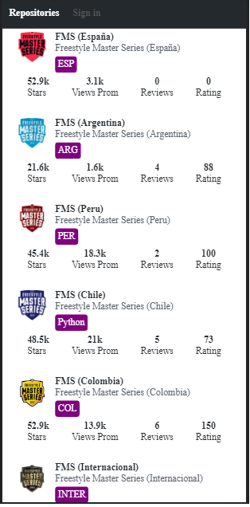
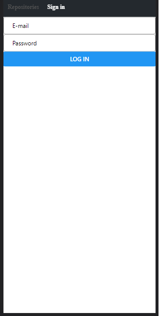
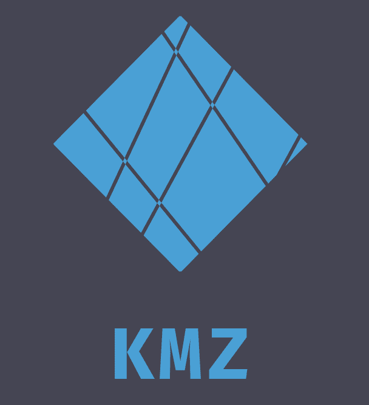

# Welcome to the Freestyle Masters Series (FMS) Mobile App 🎭🎼
An application whose purpose is to show all the participants of the different Spanish-speaking freestyle leagues, as well as important data, such as their views, ratings, etc.

# Steps to run the project 🚨:

  
  

## More info about me: 

Ing. Kevin J. Montero Zea 

CE: 004712881 🆔

+51-913-695-382 📱

<a href="https://www.linkedin.com/in/kevin913montero/">
    LinkedIn 👨‍🦰
  </a>

<a href="https://portfoliokjmz.netlify.app/">
    Portfolio 💼
  </a>

